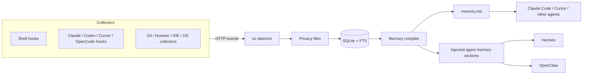

# OpenContext

> Local-first work memory for AI agents.

[中文文档](README.zh-CN.md) · [Agent install guide](INSTALL.md) · [Protocol](docs/PROTOCOL.md) · [Collectors](docs/COLLECTORS.md) · [Collector architecture](docs/COLLECTOR_ARCHITECTURE.md)

OpenContext watches lightweight work signals from the tools you already use, stores them locally, and turns them into a Markdown memory file that coding agents can read before they ask you to repeat context.

```text
You: "Continue the auth refactor from this morning."

Without OpenContext: the agent asks what changed, which tests failed, and where to look.
With OpenContext:    the agent can read recent commands, failed builds, commits,
                     active project notes, and open loops from memory.md.
```

## Why It Exists

AI coding agents are powerful, but they start most sessions without memory of what happened outside the chat. OpenContext gives them a local activity layer:

- shell commands, agent prompts, IDE hooks, and future collectors flow into one local event store
- privacy levels decide what is recorded and what is dropped
- subscriptions decide which projects and sources become agent-readable memory
- `memory.md` can be referenced by Claude Code, Cursor, Hermes, OpenClaw, and other agents

## Quick Start

```bash
npm install -g @yetanotherai/opencontext
oc --version

oc daemon
```

In another terminal:

```bash
oc status
oc collector shell install
source ~/.zshrc
```

Create `~/.opencontext/config.yaml`:

```yaml
subscriptions:
  - name: "global"
    filter:
      sources: ["shell", "claude", "codex", "cursor", "opencode"]
      max_sensitivity: 2
    memory:
      backend: "raw_dump"
      path: "~/.opencontext/memory.md"
    refresh_interval: 1800
```

Compile once and point your agent at the generated memory:

```bash
oc compile --subscription global
cat ~/.opencontext/memory.md
```

For a guided setup flow that an AI coding agent can follow for the user, see [INSTALL.md](INSTALL.md).

To keep OpenContext running in the background:

```bash
oc daemon install
oc daemon status
oc daemon logs -f
```

Service management uses launchd on macOS, systemd on Linux when available, and a pidfile-managed background process in WSL/container environments without systemd.

## Architecture



## Collectors

The default distribution keeps the core collectors inside the `oc` binary so installation is simple:

| Source | Command | Notes |
|---|---|---|
| Shell | `oc collector shell install` | zsh/bash command history with privacy filtering |
| Claude Code | `oc collector claude install` | installs Claude Code HTTP hooks |
| Codex | `oc collector codex install` | installs Codex hook adapter |
| Cursor | `oc collector cursor install` | installs Cursor hook adapter |
| OpenCode | `oc collector opencode install` | installs OpenCode hook adapter |
| macOS activity | see [Collector install guide](docs/COLLECTOR_INSTALL.md) | optional external collector, requires Accessibility permission |
| Windows activity | see [Collector install guide](docs/COLLECTOR_INSTALL.md) | optional external collector, can run foreground or via Task Scheduler |

Run `oc collectors list` and `oc collectors info <name>` to inspect the collector manifest, version, emitted sources, install command, and schema references.

Bundled hook collectors do not have separate source directories under `collectors/`; their install commands patch the target tool's hook configuration, and the daemon translates incoming hook payloads under `/api/v1/hooks/...`. The `collectors/` directory is reserved for collectors that run as their own process, such as shell, macOS activity, and Windows activity.

### Developing a Collector

OpenContext does not care which language a collector uses. A custom collector only needs to POST events that match the OpenContext event protocol:

```bash
curl -X POST http://localhost:6060/api/v1/events \
  -H "Content-Type: application/json" \
  -d '{
    "source": "my_tool",
    "type": "activity",
    "sensitivity": 1,
    "labels": {"project": "my-project"},
    "payload": {"summary": "something happened"}
  }'
```

For higher throughput, send `{ "events": [...] }` to `/api/v1/events/batch`. Schemas are advisory metadata for discovery and display; ingestion must not depend on a source-specific schema. See [docs/COLLECTOR_ARCHITECTURE.md](docs/COLLECTOR_ARCHITECTURE.md) and [docs/PROTOCOL.md](docs/PROTOCOL.md).

## Subscriptions

A subscription chooses which events become memory and where that memory is written.

Global memory:

```yaml
subscriptions:
  - name: "global"
    filter:
      sources: ["shell", "claude", "codex", "cursor", "opencode"]
      max_sensitivity: 2
    memory:
      backend: "raw_dump"
      path: "~/.opencontext/memory.md"
    refresh_interval: 1800
```

Project memory:

```yaml
subscriptions:
  - name: "my-project"
    filter:
      projects: ["my-project"]
      sources: ["shell", "claude", "codex", "cursor", "opencode"]
      max_sensitivity: 2
    memory:
      backend: "raw_dump"
      path: "/path/to/my-project/.opencontext/memory.md"
      claude_md: "/path/to/my-project/CLAUDE.md"
    refresh_interval: 1800
```

For Hermes or OpenClaw, add injection targets:

```yaml
memory:
  backend: "raw_dump"
  path: "~/.opencontext/memory.md"
  inject_targets:
    - path: "~/.hermes/memories/MEMORY.md"
      header: "## OpenContext Recent Activity"
    - path: "~/.openclaw/workspace/MEMORY.md"
      header: "## OpenContext Recent Activity"
```

## CLI

```bash
oc daemon                          # start the local daemon
oc daemon install                  # install as a background service
oc daemon restart                  # restart the background service
oc daemon logs -f                  # follow daemon logs
oc status                          # daemon health
oc events                          # recent events
oc events --source shell --since 2h --project myapp
oc events --query "go build"       # full-text search
oc collectors list                 # list known collector integrations
oc collectors info cursor          # show install/schema details
oc collectors schemas              # list event schemas
oc compile                         # trigger all subscriptions
oc compile --subscription global
oc collector shell install
oc inject hermes
oc inject openclaw
```

## Privacy

| Level | Default | Content |
|---|---:|---|
| L1 | on | app name, command name, git repo, URL domain |
| L2 | opt-in | full command args, commit messages, full URLs |
| L3 | off | keyboard input, full chat text, screenshots |

Commands starting with a space are never recorded by the shell collector.

## Build From Source

```bash
git clone https://github.com/yetanotherai/opencontext.git
cd opencontext
make build
./bin/oc --version
```

## License

MIT
