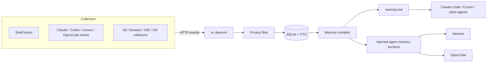

# OpenContext

> 给 AI Agent 用的本地工作记忆层。

[English](README.md) · [Agent 安装指南](INSTALL.md) · [协议文档](docs/PROTOCOL.md) · [Collector 文档](docs/COLLECTORS.md) · [Collector 架构](docs/COLLECTOR_ARCHITECTURE.md)

OpenContext 会采集你日常开发工具里的轻量信号，把它们存在本地，并生成 Agent 可直接读取的 `memory.md`。这样 Agent 不需要每次都问你“刚才做了什么、哪个测试失败了、上下文在哪里”。

```text
你说：“继续早上那个 auth refactor。”

没有 OpenContext：Agent 先问你改了什么、哪里失败、从哪个文件开始。
有 OpenContext：   Agent 可以先读 memory.md，看到最近命令、失败构建、
                  提交记录、当前项目和未完成事项。
```

## 核心思路

- Collector 从 shell、Claude Code、Codex、Cursor、OpenCode 等工具采集事件
- `oc daemon` 在本地接收事件、过滤隐私等级、写入 SQLite
- Subscription 决定哪些项目、哪些来源会进入某个记忆文件
- Agent 通过 `memory.md`、`CLAUDE.md` 引用，或 Hermes/OpenClaw 的记忆文件读取上下文

## 快速开始

```bash
npm install -g @yetanotherai/opencontext
oc --version

oc daemon
```

另开一个终端：

```bash
oc status
oc collector shell install
source ~/.zshrc
```

创建 `~/.opencontext/config.yaml`：

```yaml
subscriptions:
  - name: "global"
    filter:
      sources: ["shell", "claude", "codex", "cursor", "opencode"]
      max_sensitivity: 2
    memory:
      backend: "raw_dump"
      path: "~/.opencontext/memory.md"
    refresh_interval: 1800
```

手动编译一次：

```bash
oc compile --subscription global
cat ~/.opencontext/memory.md
```

如果你希望让用户的 AI Agent 自动完成安装和配置，把 [INSTALL.md](INSTALL.md) 发给它读。

如果希望常驻后台运行：

```bash
oc daemon install
oc daemon status
oc daemon logs -f
```

后台服务管理在 macOS 使用 launchd，在 Linux 优先使用 systemd；WSL/container 这类没有 systemd 的环境会自动退回到 pidfile 后台进程。

## 架构



## Collectors

| 来源 | 安装命令 | 说明 |
|---|---|---|
| Shell | `oc collector shell install` | zsh/bash 命令事件 |
| Claude Code | `oc collector claude install` | 安装 Claude Code HTTP hooks |
| Codex | `oc collector codex install` | 安装 Codex hook adapter |
| Cursor | `oc collector cursor install` | 安装 Cursor hook adapter |
| OpenCode | `oc collector opencode install` | 安装 OpenCode hook adapter |
| Chrome browser | `oc collector browser-chrome install` | 可选浏览器扩展，采集页面访问、tab focus、搜索、表单和明确页面操作 |
| macOS activity | 见 [Collector 安装指南](docs/COLLECTOR_INSTALL.md) | 可选外部 collector，需要 Accessibility 权限 |
| Windows activity | 见 [Collector 安装指南](docs/COLLECTOR_INSTALL.md) | 可选外部 collector，可前台运行或接入任务计划 |

可以用 `oc collectors list` 和 `oc collectors info <name>` 查看 collector 的 manifest、版本、事件来源、安装命令和 schema 引用。

Claude、Codex、Cursor、OpenCode 这类 bundled hook collector 不会在 `collectors/` 下各自放一份独立进程代码。它们的安装命令只负责修改目标工具的 hook 配置，daemon 里的 `/api/v1/hooks/...` adapter 会把第三方 payload 转成 OpenContext 事件。`collectors/` 目录只放真正需要独立运行的 collector，比如 shell、macOS activity、Windows activity。

### 自己开发 Collector

Collector 不绑定语言。你可以用 Go、Python、Rust、Shell、插件或任何进程实现，只要能往 daemon 上报 OpenContext event：

```bash
curl -X POST http://localhost:6060/api/v1/events \
  -H "Content-Type: application/json" \
  -d '{
    "source": "my_tool",
    "type": "activity",
    "sensitivity": 1,
    "labels": {"project": "my-project"},
    "payload": {"summary": "something happened"}
  }'
```

批量上报可以 POST `{ "events": [...] }` 到 `/api/v1/events/batch`。Schema 是用于发现、展示和文档的元数据，不应该成为 daemon 接收事件的强依赖。更多细节见 [docs/COLLECTOR_ARCHITECTURE.md](docs/COLLECTOR_ARCHITECTURE.md) 和 [docs/PROTOCOL.md](docs/PROTOCOL.md)。

## Subscription 示例

全局记忆：

```yaml
subscriptions:
  - name: "global"
    filter:
      sources: ["shell", "claude", "codex", "cursor", "opencode"]
      max_sensitivity: 2
    memory:
      backend: "raw_dump"
      path: "~/.opencontext/memory.md"
    refresh_interval: 1800
```

单项目记忆：

```yaml
subscriptions:
  - name: "my-project"
    filter:
      projects: ["my-project"]
      sources: ["shell", "claude", "codex", "cursor", "opencode"]
      max_sensitivity: 2
    memory:
      backend: "raw_dump"
      path: "/path/to/my-project/.opencontext/memory.md"
      claude_md: "/path/to/my-project/CLAUDE.md"
    refresh_interval: 1800
```

Hermes / OpenClaw 注入：

```yaml
memory:
  backend: "raw_dump"
  path: "~/.opencontext/memory.md"
  inject_targets:
    - path: "~/.hermes/memories/MEMORY.md"
      header: "## OpenContext Recent Activity"
    - path: "~/.openclaw/workspace/MEMORY.md"
      header: "## OpenContext Recent Activity"
```

## 常用命令

```bash
oc daemon
oc daemon install
oc daemon restart
oc daemon logs -f
oc status
oc events --since 2h
oc collectors list
oc collectors info cursor
oc collectors schemas
oc compile --subscription global
oc collector shell install
oc collector claude install
oc collector codex install
oc collector cursor install
oc collector opencode install
oc inject hermes
oc inject openclaw
```

## 隐私等级

| 等级 | 默认 | 内容 |
|---|---:|---|
| L1 | 开启 | app 名、命令名、git repo、URL 域名 |
| L2 | 用户选择开启 | 完整命令参数、commit message、完整 URL |
| L3 | 关闭 | 键盘输入、完整聊天内容、截图 |

Shell collector 不会记录以空格开头的命令。

## License

MIT
